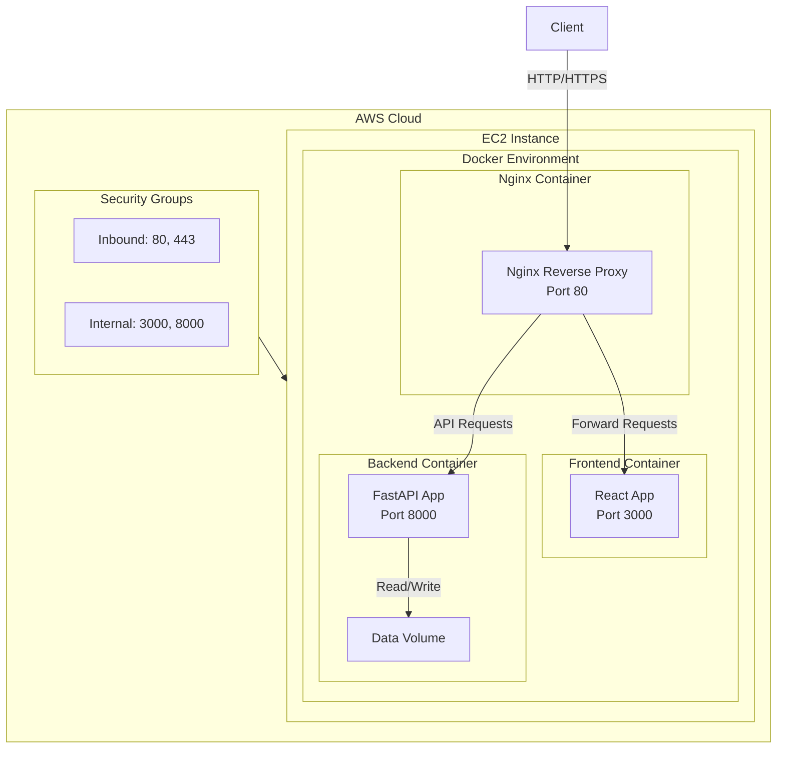

# AWS Deployment Documentation

## Overview
This repository contains the infrastructure and deployment configuration for a web application consisting of a frontend, backend, and Nginx reverse proxy. The setup is containerized using Docker and orchestrated with Docker Compose, while the infrastructure is managed using Terraform.

## Architecture
The application consists of three main components:
- **Frontend**: React application served on port 3000
- **Backend**: Python FastAPI application running on port 8000
- **Nginx**: Reverse proxy handling incoming requests on port 80



## Prerequisites
- AWS Account with appropriate credentials
- Terraform installed
- Docker and Docker Compose
- Node.js (v22)
- Python 3.10+
- Nginx

## Infrastructure Setup

### 1. Terraform Configuration
The infrastructure is defined in the `terraform` directory using Terraform. The main components include:
- EC2 instance for hosting the application
- Security groups for managing network access
- Other AWS resources as needed

To initialize and apply the Terraform configuration:
```bash
cd terraform
terraform init
terraform plan
terraform apply
```

### 2. Server Setup
The `install.sh` script in the terraform directory handles the initial server setup:
- Updates system packages
- Installs Python3 and pip
- Installs Node.js using NVM
- Installs Docker and Docker Compose
- Installs and configures Nginx
- Starts and enables required services

## Application Deployment

### 1. Docker Containers
The application is containerized using Docker with the following components:

#### Frontend Container
- Based on Node.js 20 Alpine
- Builds the React application
- Serves the built files using `serve` on port 3000

#### Backend Container
- Based on Python 3.10 slim
- Runs a FastAPI application using uvicorn
- Exposes port 8000
- Mounts a data volume for persistent storage

#### Nginx Container
- Based on Nginx Alpine
- Acts as a reverse proxy
- Handles routing between frontend and backend services

### 2. Docker Compose
The `docker-compose.yaml` file orchestrates all containers:
- Creates a bridge network for container communication
- Maps necessary ports
- Sets up volume mounts
- Manages container dependencies

To start the application:
```bash
docker-compose up -d --build
```
